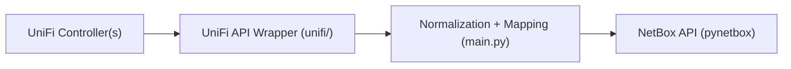

# unifi2netbox

Production-focused synchronization from UniFi controllers to NetBox.

Sync direction is primarily **UniFi -> NetBox**.
Exception: when DHCP-to-static conversion is enabled and triggered, the tool updates device IP config on UniFi.

[Quick Start](#quick-start) • [Configuration](#configuration) • [Cleanup](#cleanup) • [Testing](#testing) • [Documentation](#documentation)

## At a Glance

| Topic | Details |
|---|---|
| UniFi API support | Integration API v1 (preferred), session login fallback (UniFi OS + legacy) |
| Auth methods | API key or username/password (optional MFA secret) |
| Sync scope | Devices, interfaces, VLANs, WLANs, uplink cables, device type templates |
| Deployment | Docker, Proxmox LXC helper, bare-metal/VM via systemd installer |
| Test suite | 109 pytest tests |

## Sync Scope

| Area | Behavior |
|---|---|
| Devices | Creates/updates devices and key metadata in NetBox |
| Interfaces | Syncs physical/radio interfaces when enabled |
| VLANs | Syncs VLANs from UniFi network data |
| WLANs | Syncs SSIDs as wireless LAN objects |
| Cables | Syncs uplink cable relationships |
| IP behavior | Imports/updates primary IPs in NetBox; optional DHCP->static conversion can write static IP settings back to UniFi |
| Device types | Enriches models with interface/console/power templates |

## Architecture



Thread pools are configurable with:
- `MAX_CONTROLLER_THREADS` (default 5)
- `MAX_SITE_THREADS` (default 8)
- `MAX_DEVICE_THREADS` (default 8)

## Quick Start

### Docker (recommended)

```bash
cp .env.example .env
# Edit .env with UniFi + NetBox credentials
docker compose up --build -d
docker compose logs -f
```

Behavior:
- `.env.example` sets `SYNC_INTERVAL=600` (10 minutes)
- If `SYNC_INTERVAL` is unset, code default is `0` (run once, then exit)

### Proxmox LXC

```bash
bash lxc/create-lxc.sh [CTID]
# Edit /opt/unifi2netbox/.env inside the container
systemctl start unifi2netbox
```

### Bare-metal / VM

```bash
sudo bash lxc/install.sh
# Edit /opt/unifi2netbox/.env
systemctl start unifi2netbox
journalctl -u unifi2netbox -f
```

## Configuration

Configuration source:
1. Environment variables (`.env`)

### Required Variables

| Variable | Required | Notes |
|---|---|---|
| `UNIFI_URLS` | Yes | Comma-separated URLs or JSON array |
| `NETBOX_URL` | Yes | NetBox base URL |
| `NETBOX_TOKEN` | Yes | NetBox API token |
| `NETBOX_IMPORT_TENANT` or `NETBOX_TENANT` | Yes | Tenant used for synced objects (`NETBOX_IMPORT_TENANT` wins if both are set) |
| `UNIFI_API_KEY` | Conditionally | Required if not using username/password |
| `UNIFI_USERNAME` + `UNIFI_PASSWORD` | Conditionally | Required if not using API key |

### UniFi API Modes

| Mode | URL examples | Auth |
|---|---|---|
| Integration API v1 | `https://controller.example.com/proxy/network/integration/v1` or `https://controller.example.com/integration/v1` | API key (`UNIFI_API_KEY`) |
| Session login fallback | Controller base URL | Username/password (`UNIFI_USERNAME`, `UNIFI_PASSWORD`), optional `UNIFI_MFA_SECRET` |

When API key mode is used, header candidates are probed automatically (`X-API-KEY`, `Authorization`, or custom `UNIFI_API_KEY_HEADER`).
`unifi.ui.com` cloud API keys are not the same as local Network Application Integration API keys and are not supported as drop-in replacements here.

### Common Toggles

| Variable | Purpose |
|---|---|
| `SYNC_INTERFACES` | Sync interfaces |
| `SYNC_VLANS` | Sync VLANs |
| `SYNC_WLANS` | Sync WLANs |
| `SYNC_CABLES` | Sync uplink cables |
| `SYNC_STALE_CLEANUP` | Mark missing UniFi devices offline |
| `NETBOX_CLEANUP` | Enable destructive cleanup phase |
| `CLEANUP_STALE_DAYS` | Stale-device grace period before deletion |
| `NETBOX_VRF_MODE` | `none`, `existing`, `create` |
| `NETBOX_DEFAULT_VRF` | Override site-based VRF selection with one VRF name for all imported IPs |
| `NETBOX_SERIAL_MODE` | `mac`, `unifi`, `id`, `none` |
| `UNIFI_SPECS_AUTO_REFRESH` | Refresh device specs from upstream Device Type Library at startup |
| `UNIFI_SPECS_INCLUDE_STORE` | Also enrich specs from UniFi Store technical specs (slower) |
| `SYNC_INTERVAL` | Loop interval in seconds (`0` = run once) |

HTTP tuning:
- `UNIFI_REQUEST_TIMEOUT` (default 15s)
- `UNIFI_HTTP_RETRIES` (default 3)
- `UNIFI_RETRY_BACKOFF_BASE` (default 1.0)
- `UNIFI_RETRY_BACKOFF_MAX` (default 30.0)
- `UNIFI_VERIFY_SSL` (default `true`)
- `NETBOX_VERIFY_SSL` (default `true`)
- `UNIFI_PERSIST_SESSION` (default `true`)

Full reference: [`docs/configuration.md`](docs/configuration.md).

## Device Type Enrichment

Runtime merge sources:
- Hardcoded `UNIFI_MODEL_SPECS` in `unifi/model_specs.py` (**46 models**)
- Community bundle `data/ubiquiti_device_specs.json` (**173 by model**, **166 by part number**)
- Optional upstream refresh from `netbox-community/devicetype-library` + UniFi Store specs

Hardcoded fields override community values when both exist.

Manual refresh command:
```bash
python3 tools/refresh_unifi_specs.py
```

Resulting enrichment can include:
- interface templates and media types
- PoE mode/type metadata
- console port templates
- power port templates and draw fields
- part number and physical attributes

Details: [`docs/device-specs.md`](docs/device-specs.md).

## Cleanup

`NETBOX_CLEANUP=true` enables destructive cleanup after sync.

> Warning: this can permanently delete NetBox data.

Cleanup tasks:
- stale devices (after grace period)
- garbage/orphan interfaces (names containing `?`)
- orphan IP addresses (unassigned)
- orphan cables (missing terminations)
- unused Ubiquiti device types

Safety guide: [`docs/cleanup.md`](docs/cleanup.md).

## Testing

```bash
pip install -r requirements.txt
pip install pytest~=8.0
pytest tests/ -v
```

Current suite: **109 tests**.

## Project Layout

```text
.
├── main.py
├── sync/
│   ├── ipam.py
│   ├── log_sanitizer.py
│   ├── runtime_config.py
│   └── vrf.py
├── unifi/
│   ├── unifi.py
│   ├── resources.py
│   ├── sites.py
│   ├── device.py
│   ├── model_specs.py
│   ├── spec_refresh.py
│   ├── networkconf.py
│   └── wlanconf.py
├── data/
│   └── ubiquiti_device_specs.json
├── tools/
│   └── refresh_unifi_specs.py
├── docs/
├── tests/
├── lxc/
├── Dockerfile
├── docker-compose.yml
└── requirements.txt
```

## Documentation

- [`docs/configuration.md`](docs/configuration.md)
- [`docs/cleanup.md`](docs/cleanup.md)
- [`docs/device-specs.md`](docs/device-specs.md)
- [`docs/architecture.md`](docs/architecture.md)
- [`docs/troubleshooting.md`](docs/troubleshooting.md)
- [`docs/faq.md`](docs/faq.md)
- [`CHANGELOG.md`](CHANGELOG.md)

## Security Note

TLS verification is configurable per side:
- `UNIFI_VERIFY_SSL` (default `true`)
- `NETBOX_VERIFY_SSL` (default `true`)

Set either to `false` only if you explicitly accept the risk (for example lab environments with self-signed certs).

## Support

If my repositories are useful:

<p align="center">
  <a href="https://www.buymeacoffee.com/patricklind">
    
  </a>
</p>

## License

MIT (`LICENSE`).
